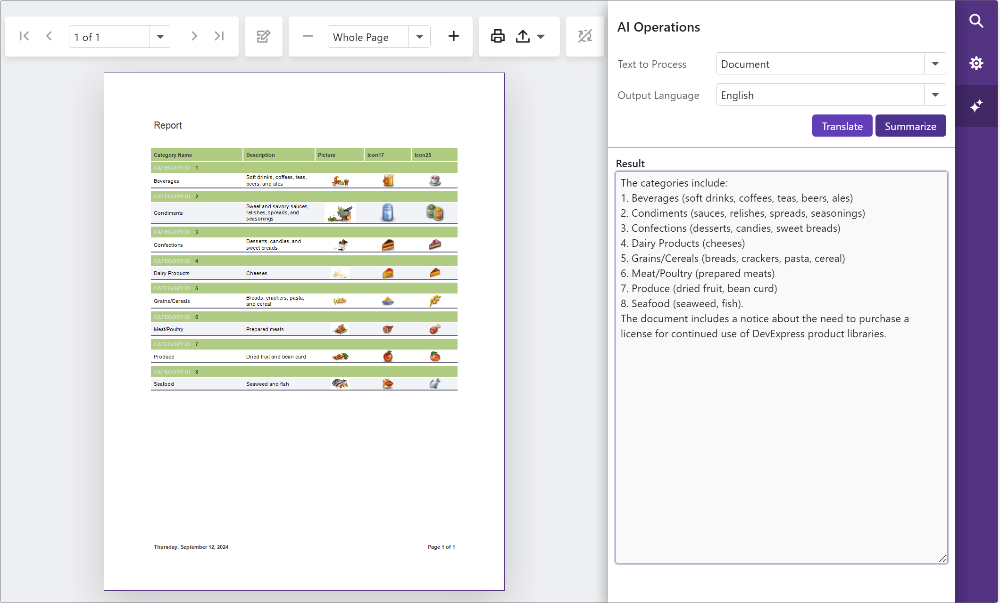

<!-- default badges list -->

[](https://supportcenter.devexpress.com/ticket/details/T1253240)
[](https://docs.devexpress.com/GeneralInformation/403183)
[](#does-this-example-address-your-development-requirementsobjectives)
<!-- default badges end -->
# Reporting for Blazor - Summarize and Translate DevExpress Reports Using Azure OpenAI 

This example adds AI-powered summarize/translate capabilities to the DevExpress Blazor Report Viewer. These capabilities are available within the user interface via two buttons designed to access the report document and process content as follows: 

- **Summarize**: Uses generative AI to summarize report content and displays core insights associated with this report. 
- **Translate**: Uses AI services to translate report content to another language. 

The following is an image of the application interface. As you can see, users can process the entire document, individual pages, or selected content. 



## Implementation Details

### Add NuGet Packages

Add the following NuGet packages:

- `DevExpress.AIIntegration.Blazor.Reporting.Viewer`
- `DevExpress.AIIntegration.Azure.OpenAI` or `DevExpress.AIIntegration.OpenAI` based on your AI service preferences. This project uses Azure OpenAI. The remainder of this document describes steps related to this package.  

### Add Personal Keys

To use AI-based Summarize and Translate functionality in your application, you must create an Azure OpenAI resource in the Azure portal. Refer to the following help topic for additional information/guidance: [Microsoft - Create and deploy an Azure OpenAI Service resource](https://learn.microsoft.com/en-us/azure/ai-services/openai/how-to/create-resource?pivots=web-portal).

Once you obtain a private endpoint and an API key, open [appsettings.json](./CS/BlazorReportViewer/appsettings.json) and specify `DeploymentName`, `AzureOpenAIKey`, and `AzureOpenAIEndpoint` values. Note that `DeploymentName` is set to `GPT4o`, but you can specify a different model: 

```json
"AISettings": {
    "DeploymentName": "GPT4o",
    "AzureOpenAIKey": "",
    "AzureOpenAIEndpoint": ""
}
``` 

Create a class to read these settings:

```cs
public class AISettings {
    public string AzureOpenAIKey { get; set; }
    public string DeploymentName { get; set; }
    public string AzureOpenAIEndpoint { get; set; }
}
```

### Register AI Services

Call the `AddDevExpressAI` method at the application startup to register AI services in your application:

```cs
using DevExpress.AIIntegration;
using DevExpress.AIIntegration.Reporting;
using DevExpress.AIIntegration.Blazor.Reporting.Viewer.Models;
using Azure.AI.OpenAI;
using Azure;
// ...
var builder = WebApplication.CreateBuilder(args);

var settings = builder.Configuration.GetSection("AISettings").Get<AISettings>();
builder.Services.AddDevExpressAI((config) => {
    config.RegisterChatClientOpenAIService(new AzureOpenAIClient(
        new Uri(settings.AzureOpenAIEndpoint),
        new AzureKeyCredential(settings.AzureOpenAIKey)
        ),settings.DeploymentName);
    config.AddBlazorReportingAIIntegration(config => {
        config.SummarizeBehavior = SummarizeBehavior.Abstractive;
        config.AvailabelLanguages = new List<LanguageItem>() {
            new LanguageItem() { Key = "de", Text = "German" },
            new LanguageItem() { Key = "es", Text = "Spanish" },
            new LanguageItem() { Key = "en", Text = "English" }
        };
    });
});

var app = builder.Build();
```

## Files to Review 

- [Program.cs](./CS/BlazorReportViewer/Program.cs)
- [AISettings.cs](./CS/BlazorReportViewer/Settings/AISettings.cs)
- [appsettings.json](./CS/BlazorReportViewer/appsettings.json)

## More Examples

- [Reporting for ASP.NET Core - Summarize and Translate DevExpress Reports Using Azure OpenAI](https://github.com/DevExpress-Examples/reporting-aspnet-core-ai-summarize-and-translate)
- [Reporting for ASP.NET Core - Integrate AI Assistant based on Azure OpenAI](https://github.com/DevExpress-Examples/web-reporting-integrate-ai-assistant/)
- [Rich Text Editor and HTML Editor for Blazor - How to integrate AI-powered extensions](https://github.com/DevExpress-Examples/blazor-ai-integration-to-text-editors)
- [AI Chat for Blazor - How to add DxAIChat component in Blazor, MAUI, WPF, and WinForms applications](https://github.com/DevExpress-Examples/devexpress-ai-chat-samples)

<!-- feedback -->
## Does this example address your development requirements/objectives?

[](https://www.devexpress.com/support/examples/survey.xml?utm_source=github&utm_campaign=blazor-reporting-ai-summarize-and-translate&~~~was_helpful=yes) [](https://www.devexpress.com/support/examples/survey.xml?utm_source=github&utm_campaign=blazor-reporting-ai-summarize-and-translate&~~~was_helpful=no)

(you will be redirected to DevExpress.com to submit your response)
<!-- feedback end -->
